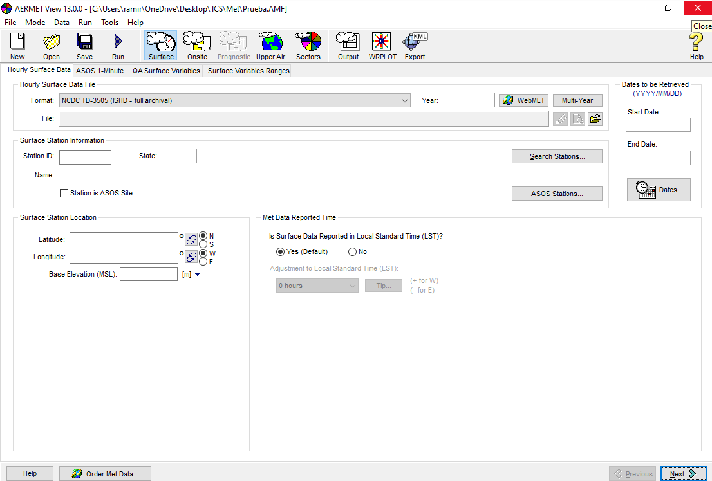
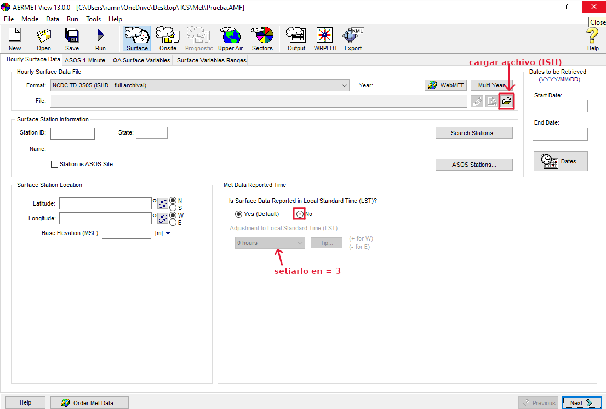
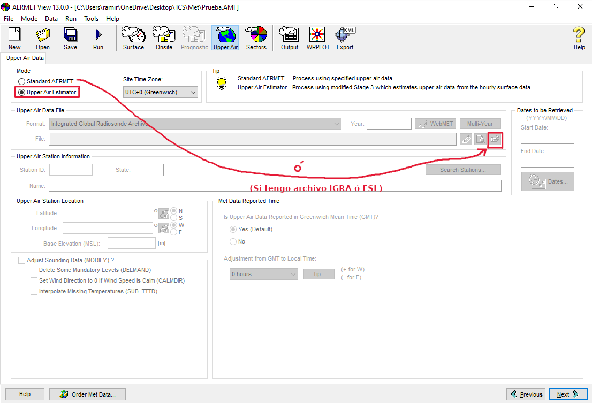
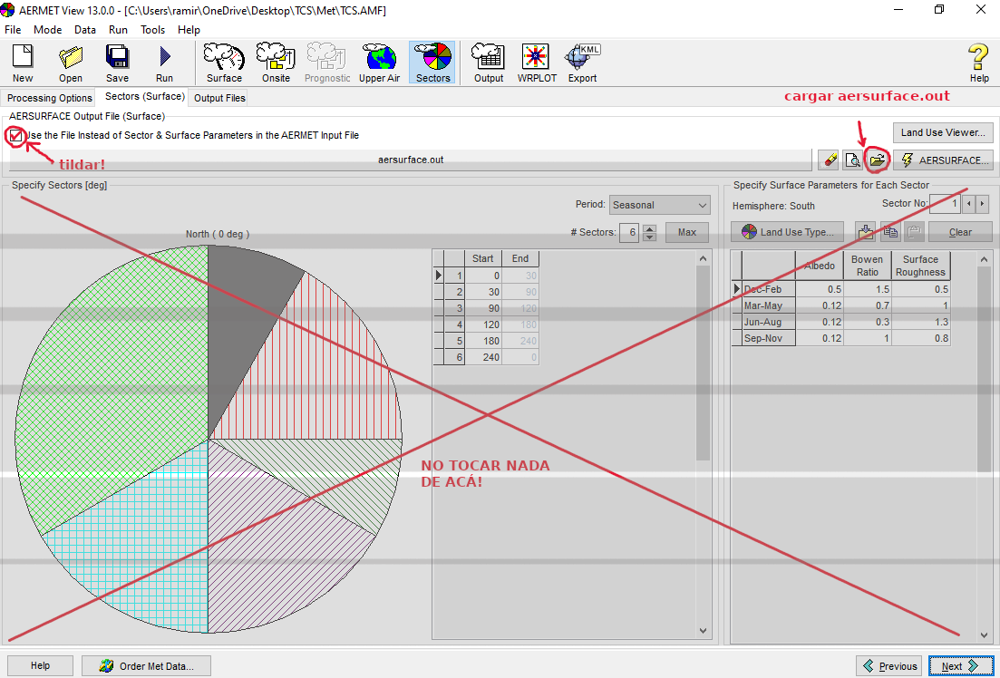

> Implementación de AERMET View para las zonas de descarga.

## Datos

Archivos especificos de este proyecto:

- Descargar archivos meteorológicos de superficie del [Integrated Surface Database (ISD)](https://www.ncei.noaa.gov/pub/data/noaa/). 
- Descargar archivos meteorologicos de radiosondeos de [NOAA/ESRL Radiosonde Database](https://ruc.noaa.gov/raobs). Buscar archivos por `id` de la estación y año.
- Descargar archivos meteorológicos de [estación local Davis](https://www.weatherlink.com/bulletin/d546f3c5-bc92-4c2c-af0e-3ada6d2027d4)
- [AERSURFACE.OUT](./data/aersurface.out)

## Ejecución de AERMET

1. Abrir **AERMET View** . 
Aparecerá una ventana de inició, hacer click en "OK" (abajo a la izquierda).

2. **Crear proyecto** haciendo click en "New"  

- Especificar ubicación y nombre del archivo del proyecto. Por ejemplo:

Al hacerlo deberian ver algo asi:

4. **Meteorología de superficie** 
- Importar archivos meteorológicos de superficie (ISH)

5. **Radiosondeos** 
- Importar archivo de radiosondeos (FSL ó IGRA)
- En caso de no tenerlos, en la sección de `Mode`, tildar la opción de `Upperair estimator`.

6. **Estación local** (*On-site*) 
- Preparar archivo meteorológico para que esté separado por espacios, los separadores decimales sean ".", y verificar las unidades de las variables:

| Variable|  Descripción  |  Unidades |
|:--------|:--------------|:---------:|
|`OSYR`   | Año  (YYYY)   |    -      |
|`OSMO`   | Mes    (MM)   |    -      |
|`OSDY`   | Día    (DD)   |    -      |
|`OSHR`   | Hora   (HH)   |    -      |
|`OSMN`   | Minuto (MM)   |    -      |
|`TT01`   | Temperatura   | ºC        |
|`PRES`   | Presión       | hPa\*10   |
|`WS01`   | Vel. Viento   | m/s       |
|`WD01`   | Dir. Viento   | grados    |
|`RH01`   | Humedad       | %         |
|`DP01`   | Punto de rocío| ºC        |
|`PRCP`   | Precipitacion | mm\*10    |

- Importar archivos meteorológicos de estación local.
- Especificar variables. Por ejemplo: `OSYR OSMO OSDY OSHR OSMN TT01 PRES WS01 WD01 RH01 DP01 PRCP`
- Especificar formato `FREE Format`.

7. **Sectores** 
- En processing options, setiar altura del anemometro (generalmente 10m)
- En la sección de `Sectors`: tildar la casilla de `Use the File instead of the Sector \& Surface parameters ..` y cargar el archivo `aersurface.out`.

8. **Opciones de salida** 
- Dejar valores dados por defecto.

9. **Ejecutar AERMET**  

