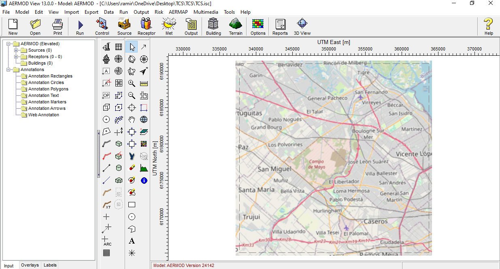
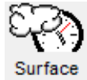
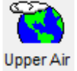
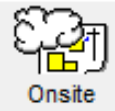

> Implementación de AERMET View para las zonas de descarga.

## Datos

Archivos especificos de este proyecto:

- Descargar archivos meteorológicos de superficie del [Integrated Surface Database (ISD)](https://www.ncei.noaa.gov/pub/data/noaa/). 
- Descargar archivos meteorologicos de radiosondeos de [NOAA/ESRL Radiosonde Database](https://ruc.noaa.gov/raobs). Buscar archivos por `id` de la estación y año.
- [AERSURFACE.OUT](./data/aersurface.out)

## Pasos para ejecución

### AERMET

1. Abrir **AERMOD View** . 
Aparecerá una ventana de inició, hacer click en "OK" (abajo a la izquierda).

2. **Crear proyecto** haciendo click en "New"  

- Especificar ubicación y nombre del archivo del proyecto. Por ejemplo:

| Parametro       | Valor |
|-----------------|-------|
| Project location| `C:\Curso_AERMOD\TCS\`   |
| Project name    | TCS                      |

- Especificar Proyección y sistema de coordenadas:

| Parametro       | Valor |
|-----------------|-------|
| Projection      | UTM: Universal Transverse Mercator |
| Datum           | WGS-84                             |
| UTM-Zone        | 21                                 |
| Hemisphere      | South (S)                          |

- Especificar Parámetros de dominio:

| Parametro       | Valor |
|-----------------|-------|
| Ref. point (Lat )      |  34.5282252 (S)| 
| Ref. point (Long)      |  58.6265442 (W)|
| Ref. point (Position)  | Center         |
| Radius for Mod. Area   | 13 km          |

- Revisar, y al terminar clickiar en el botón de `Finish`. Al hacerlo deberian ver algo asi:

4. **Meteorología de superficie** 
- Importar archivos meteorológicos de superficie (ISH)

5. **Radiosondeos** 
- Importar archivo de radiosondeos (FSL ó IGRA)

6. **Estación local** (*On-site*) 
- Importar archivos meteorológicos de estación local.
- Especificar variables.
- Especificar formato.

7. **Opciones de salida** 
- Dejar valores dados por defecto.

