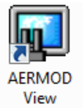
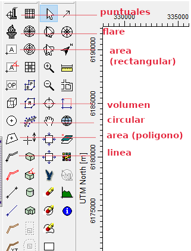
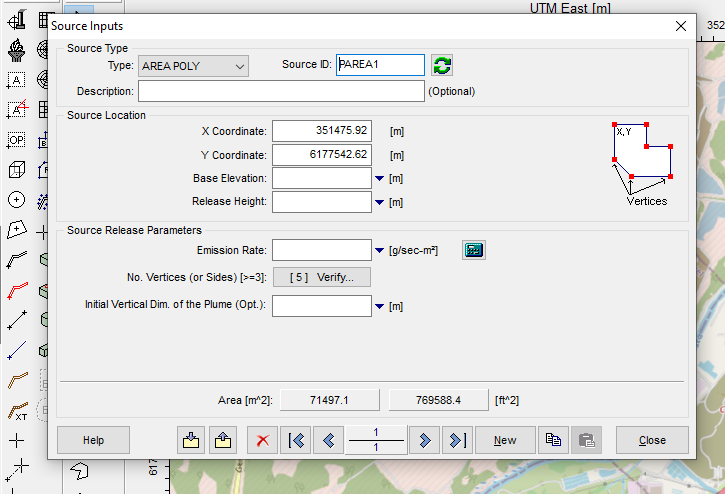
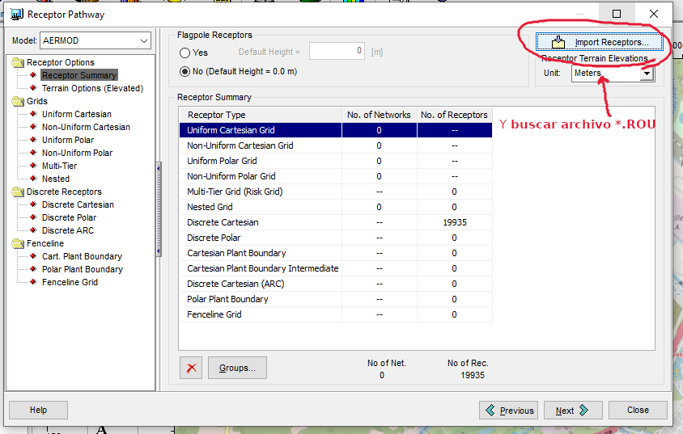
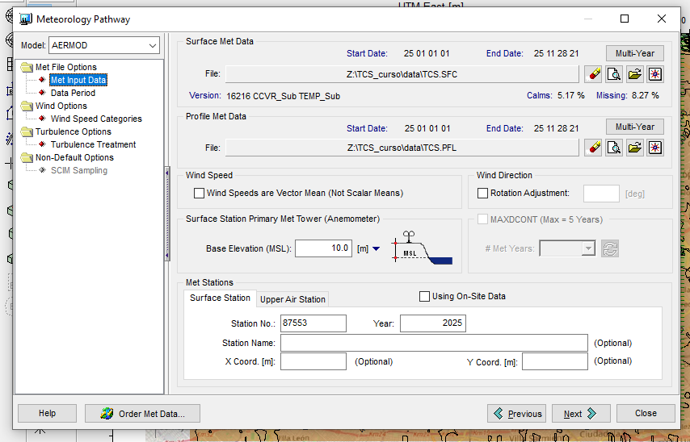
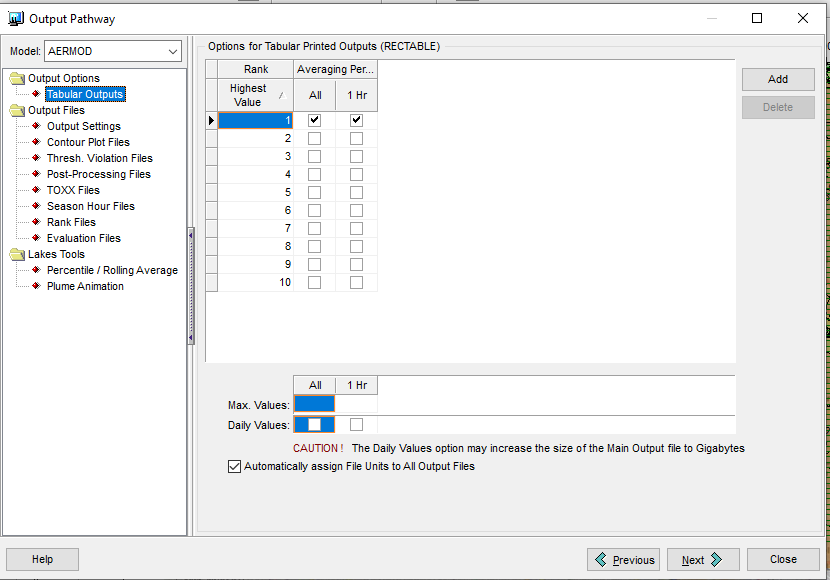
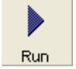
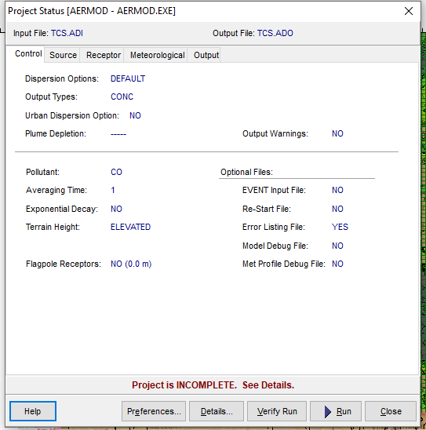

> Implementación de AERMOD View para las zonas de descarga.

## Datos

Antes de empezar asegurarse de contar con los siguientes archivos:
- Salida AERMET (SFC): [TCS.SFC](./data/TCS.SFC)
- Salida AERMET (PFL): [TCS.PFL](./data/TCS.PFL)
- Grilla de receptores AERMAP (ROU): [TCS.ROU](./data/TCS.ROU) 

## Pasos para ejecución de AERMOD View

1. Abrir **AERMOD View** . 
Aparecerá una ventana de inició, hacer click en "OK" (abajo a la izquierda).

2. **Crear proyecto** haciendo click en "New"  

- Especificar ubicación y nombre del archivo del proyecto. Por ejemplo:

| Parametro       | Valor |
|:----------------|:-----:|
| **Project location**| `C:\Curso_AERMOD\TCS\`   |
| **Project name**| TCS                      |

- Especificar Proyección y sistema de coordenadas:

| Parametro       | Valor |
|:----------------|:-----:|
| **Projection**    | UTM: Universal Transverse Mercator |
| **Datum**    | WGS-84                             |
| **UTM-Zone**    | 21                                 |
| **Hemisphere**    | South (S)                          |

- Especificar Parámetros de dominio:

| Parametro       | Valor |
|:----------------|:-----:|
| **Ref. point (Lat )**  |  34.5282252 (S)| 
| **Ref. point (Long)**  |  58.6265442 (W)|
| **Ref. point (Position)**  | Center         |
| **Radius for Mod. Area**  | 13 km          |

- Revisar, y al terminar clickiar en el botón de `Finish`. Al hacerlo se va abrir la pantalla principal que debería verse algo así:

En el centro se ve un mapa con nuestro dominio de estudio. A la izquierda de esta pantalla hay botones con opciones de navegación, visualización y otras opciones como la creación de fuentes de emisión.
La barra vertical izquierda permite seleccionar capas de información espacial que se van a ir cargando a medida que avancemos con el seteo de la corrida.
La barra horizontal superior muestra las distintas etapas a ir completando para lograr una ejecución exitosa. 

3. **Parámetros globales**  
- Dejar valores por defecto, 
- seleccionar periodos de promediado deseados, 
- usar la opcion de terreno elevado.

4. **Emisiones** 
En la pantalla principal, a la izquierda hay una barra vertical que nos permite definir distintos tipos de fuentes y ubicarlas en espacialmente usando el mouse y clickiando en el mapa.

Usar el botón de "Polygon area source" y dibujar con el mouse la fuente de emisión areal. Usar el botón derecho del mouse para definir cada vertice y al terminar presionar el botón izquierdo del mouse. Al terminar se abrira una ventana que nos permitirá setiar los parámetros de emisión deseados:

5. **Receptores** 
- Importar receptores (Buscar el archivo `TCS.ROU`)

6. **Meteorología** 
- Importar archivos de superficie (`TCS.SFC`) y de perfil (`TCS.PFL`)

7. **Opciones de salida** 
- Dejar valores dados por defecto.

8. **Ejecutar**  

