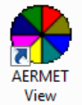
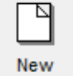
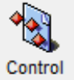
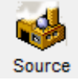
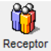
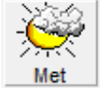
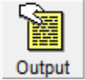
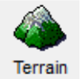

> Implementación de AERMOD View para las zonas de descarga.

## Datos

Archivos especificos de este proyecto:
- Salida AERMET (SFC): [TCS.SFC](./data/TCS.SFC)
- Salida AERMET (PFL): [TCS.PFL](./data/TCS.PFL)
- Grilla de receptores AERMAP (ROU): [TCS.ROU](./data/TCS.ROU) 

## Pasos para ejecución

### AERMET

1. Abrir "AERMET View": 
2. Aparecerá una ventana de inició, hacer click en "OK" (abajo a la izquierda).
3. Iniciar nuevo proyecto haciendo click en "New"  
4. Especificar ubicación y nombre del archivo del proyecto.
Por ejemplo:

| Parametro      | Valor |
|----------------|-------|
| Folder location| `C:\Curso_AERMOD\Prueba\Met`   |
| Project name   | Relleno                        |

### AERMOD

1. Abrir "AERMET View": . Aparecerá una ventana de inició, hacer click en "OK" (abajo a la izquierda).

2. Crear un proyecto nuevo haciendo click en "New"  

3. Especificar ubicación y nombre del archivo del proyecto. Por ejemplo:

| Parametro       | Valor |
|-----------------|-------|
| Project location| `C:\Curso_AERMOD\TCS\`   |
| Project name    | TCS                      |

4. Especificar Proyección y sistema de coordenadas:

| Parametro       | Valor |
|-----------------|-------|
| Projection      | UTM: Universal Transverse Mercator |
| Datum           | WGS-84                             |
| UTM-Zone        | 21                                 |
| Hemisphere      | South (S)                          |

5. Especificar Parámetros de dominio:

| Parametro       | Valor |
|-----------------|-------|
| Ref. point (Lat )      |  34.5282252 (S)| 
| Ref. point (Long)      |  58.6265442 (W)|
| Ref. point (Position)  | Center         |
| Radius for Mod. Area   | 13 km          |

6. Revisar, y al terminar clickiar en el botón de `Finnish`. 

7. Setiar parámetros globales    
Dejar valores por defecto, seleccionar periodos de promediado deseados, usar la opcion de terreno elevado.

8. Crear fuentes de emisión      

9. Definir grillas de receptores 

10. Cargar meteorología          

11. Opciones de salida           

12. Terreno/Topografía           

Para ejecutar este proyecto necesitamos:
1. Descargar ejecutables.
2. Definir dominio de estudio, límites del predio y grilla de receptores en sistema de coordenadas plano (proyectado).
3. Descargar archivos meteorológicos de superficie del [Integrated Surface Database (ISD)](https://www.ncei.noaa.gov/pub/data/noaa/). Y radiosondeos de de [NOAA/ESRL Radiosonde Database](https://ruc.noaa.gov/raobs). Buscar archivos por `id` de la estación y año.
4. Descargar [modelo digital de elevación](https://www.ign.gob.ar/NuestrasActividades/Geodesia/ModeloDigitalElevaciones/Mapa) (DEM) que contenga el domino que queremos modelar. Reproyectar DEM a sistema de coordenadas definido en el punto 2.
5. Descargar ó construir el archivo `aersurface.out` en base a la cobertura de suelo en las cercanías de la estación de superficie.
6. Descargar y completar los **archivos de control** (`stg1.inp`, `stg2.inp`, `stg3.inp`,`aermap.inp`, `bpip.inp`, `aermod.inp`).
7. Colocar todos los archivos mencionados en un directorio común.
8. Ejecutar programas haciendo doble click sobre el ejecutable o si están en la shell, por ejemplo: ``./aermod.exe < aermod.inp``. El orden recomendado de ejecución es: 1) aersurface 2) aermet, 3) aermap, 4) bpip, 5) aermod.
9. Post-procesar salidas para crear mapas, gráficos y tablas.

