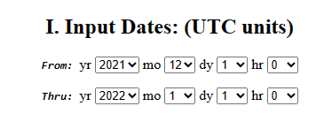
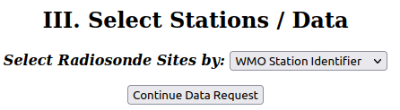
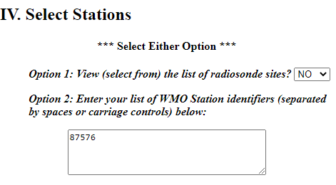
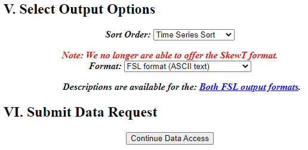

--- 
layout: lecture
title: Aermet
descripcion: Preprocesador de meteorología.
date: 2024-09-02
ready: true
---

# AERMET

Tutorial para ejecución de preprocesador meteorológico del aermod (**AERMET**). Para mayor información se recomienda consultar la [guía de usuario](https://gaftp.epa.gov/Air/aqmg/SCRAM/models/met/aermet/aermet_userguide.pdf).
{: .fs-6 .fw-300 }

---

## Directorio de trabajo

Durante la ejecución del **AERMOD** y todos sus programas asociados vamos a trabajar con muchos archivos. Para mantener el orden y evitar errores, sugerimos generar una carpeta ó *directorio de trabajo* donde vamos a colocar todos los archivos y ejecutables, sin importar que nombre y ubicación le asignamos.
Como vamos a estar modificando las extensiones de varios archivos, debemos asegurar que estas están visibles.
En Windows 10, en el directorio de trabajo activamos esa opción desde la pestaña "Vista", tildando el casillero:"Extensiones de nombre de archivo".


## Descarga de ejecutable

Descargamos el programa de la página de la EPA: [``aermet_exe.zip``](https://gaftp.epa.gov/Air/aqmg/SCRAM/models/met/aermet/aermet_exe.zip), lo descomprimimos y colocamos el ejecutable ``aermet.exe`` en la carpeta de trabajo.

## Descarga de datos meteorológicos:

Para poder ejecutar el **AERMET** vamos a necesitar disponer de datos meteorológicos de superficie y radiosondeos. 

Para descargar datos meteorológicos tienen que buscar la estación más cercana al proyecto a modelar que cuente con buena disponibilidad de datos. Del listado de [estaciones disponibles](refs/estaciones_smn.csv), se debe elegir la mas cercana y obtener su *id* definido globalmente por la Organización Mundial de Meteorología (WMO), que se encuentra en la columna ``NRO``.

**En este tutorial vamos a seleccionar para el año *2021*, la siguiente estación:

| Nombre	|Provincia	|Longitud|Latitud	|Altura [m]	|NRO	   |NACI |
|EZEIZA AERO	|BUENOS AIRES	|-58.53333	|-34.81667	|20.0	        |**87576** |SAEZ |


### Meteorología de superficie: 

Los datos de meteorología de superficie se pueden descargar del [Integrated Surface Database (ISD)](https://www.ncei.noaa.gov/pub/data/noaa/) y buscando por año (2021) y luego por id (87576) van a encontrar el archivo.

Vamos a buscar nuestro archivo usando el año de interés y el *id* de la estación. Para nuestro caso tendríamos que descargar el archivo: [``https://www.ncei.noaa.gov/pub/data/noaa/2021/875760-99999-2021.gz``](https://www.ncei.noaa.gov/pub/data/noaa/2021/875760-99999-2021.gz)

Se va a descargar un archivo comprimido con extensión ``.gz`` (gzip), al descomprimirlo encontraremos un archivo de texto de nombre [875760-99999-2021](./archivos/aermod/875760-99999-2021), lo vamos a renombrar ``PRUEBA.ISH``. Si lo abren verán el siguiente contenido:

```Text
0124875760999992021010100004-34467-058517FM-12+002099999V0203401N0015122000199010000199+02601+00621101151ADDAA101999999AZ101061AZ201061GF100991999999999999999999KA1120M+03031KA2120N+01751MA1999999100921MD1210051+9999REMSYN004BUFR
0078875760999992021010100004-34822-058536FM-15+002099999V0203201N001519999999Y009900599+02601+00601999999ADDMA1101101999999REMMET051METAR SAEZ 010000Z 32003KT CAVOK 26/06 Q1011 NOSIG=
0089875760999992021010101004-34817-058533FM-12+002099999V0203401N001519999999N010000199+02501+00741101201ADDMA1999999100971MD1210081+9999REMSYN04887576 42960 03403 10250 20074 30097 40120 52008=
... (continúa)
```

### Radiosondeos:

Para el caso de la información del perfil de la atmósfera por radiosondeos, en Argentina solamente contamos con 6 estaciones que hacen esta medición, donde Ezeiza y Aeroparque alternan como sitio de lanzamiento para Buenos Aires:


|Nombre				|Provincia	|Longitud	|Latitud	|Altura [m]	|NRO	|NACI|
|---|---|---|---|---|---|---|
|EZEIZA AERO			|BUENOS AIRES	|-58.53333	|-34.81667	|20.0		|87576	|SAEZ|
|AEROPARQUE             |BUENOS AIRES   |-58.42     |-34.68     |6.0            |87582|SABE|
|SANTA ROSA AERO		|LA PAMPA	|-64.26667	|-36.56667	|191.0		|87623	|SAZR|
|MENDOZA AERO			|MENDOZA	|-68.78333	|-32.83333	|704.0		|87418	|SAME|
|RESISTENCIA AERO		|CHACO		|-59.05000	|-27.45000	|52.0		|87155	|SARE|
|COMODORO RIVADAVIA AERO	|CHUBUT		|-67.50000	|-45.78333	|46.0		|87860	|SAVC|
|CORDOBA AERO			|CORDOBA	|-64.20000	|-31.30000	|495.0		|87344	|SACO|


Los radiosondeos se descargan de [NOAA/ESRL Radiosonde Database](https://ruc.noaa.gov/raobs), donde al completar un formulario se va a generar un archivo con la información requerida.

Primero nos va a pedir la fecha de inicio y fin de la serie de datos que queremos descargar.

 

Luego vamos a tener que especificar horas de acceso (seleccionar ``0z, 12z ONLY``), los niveles verticales (seleccionar ``All levels``), y las unidades para la velocidad de viento (seleccionar ``Tenths of Meters/Second``) en decenas de metros por segundo.

 

Por ultimo en para la selección de sitios poner ``WMO Station Identifier``.

 

Hacemos click en ``Continue Data Request`` y nos lleva a la siguiente pantalla donde hay un cuadro para completar con el id de nuestra estación (87576, correspondiente a EZEIZA AERO).



Dejamos los valores de orden como ``Time Series Sort`` y formato ``FSL`` por defecto. Finalizamos tocando ``Continue Data Access``


Vamos a obtener como texto la información solicitada. Para guardarla, seleccionamos toda la información <kbd>Ctrl</kbd> + <kbd>A</kbd> y la copiamos <kbd>Ctrl</kbd> + <kbd>C</kbd>. Abrimos el block de notas, pegamos esta información y guardamos el archivo como [PRUEBA.FSL](./archivos/aermod/PRUEBA.FSL) en el directorio de trabajo.

El inicio del archivo debiera tener este contenido:

```Text
   254     12      1      DEC    2021
      1  99999  87576  34.82S 58.53W    20  99999
      2  99999   1500   1010     56  99999      3
      3          SAEZ                99999     ms
      9  10140     20    184    149    120     21
      6  99999  16764  99999  99999    260    252
      6  99999  17678  99999  99999    230    185
      6  99999  17983  99999  99999    220    108
      6  99999  18288  99999  99999    105      5
      6  99999  20421  99999  99999     85     72
      6  99999  20726  99999  99999     70     77
      6  99999  21031  99999  99999     75     77
      6  99999  21336  99999  99999     95     77
      6  99999  21945  99999  99999     55     72
      6  99999  22555  99999  99999     80     98
      6  99999  23164  99999  99999     50    123
      6  99999  23774  99999  99999     75    118
      6  99999  24079  99999  99999     65    123
... (continúa)
```

<!-- ### Datos sitio-especificas 
En caso de disponer datos de una estación meteorológica privada también es posible incorporar los datos al modelo, solo es necesario que estén en algún formato tipo tabla donde cada fila sea una observación y cada columna sea una variable distinta, como puede ser una planilla de excel.  
-->

## Ejecución

Para ejecutar el **AERMET** primero verificamos que estén todos los archivos necesarios en el directorio de trabajo:
+ ``PRUEBA.ISH``
+ ``PRUEBA.FSL``
+ ``aermet.exe``

El **AERMET** realiza dos tareas principales, extraer la información meteorológica, controlando su consistencia y luego realiza cálculos de parámetros de capa límite, requeridos para el uso de **AERMOD**. Estos dos pasos se denominan **ETAPA1** y **ETAPA2**. 

Pueden realizarse de forma separada, repitiendo la **ETAPA1** hasta asegurar que los datos meteorológicos no presentan problemas y luego avanzar a la **ETAPA2**.
Para este tutorial realizaremos las dos etapas seguidas.

El programa necesita un *archivo de control*, que es un archivo de texto con definición de parámetros para configurar la corrida y permitirle a **AERMET** realizar cada etapa con los datos que disponemos.

Creamos un archivo de texto en el directorio de trabajo y lo nombramos: [``AERMET.INP``](./archivos/aermet/AERMET.INP), este será el archivo de control.  


Dentro de cada etapa introduciremos instrucciones o ``keyowrds`` al archivo de texto dentro de rutas o ``pathways``. 
El archivo de control será estructurado de la siguiente manera:

+ ``JOB``
+ ``SURFACE``
+ ``UPPERAIR``
+ ``METPREP``


### Etapa 1:  Lectura y procesamiento de datos de entrada.


En esta etapa tenemos que proveer al **AERMET** con los archivos de entrada y parámetros para extraerlos.


#### JOB
   
   Incluimos este texto al archivo de control:
   ```Text
   ** ETAPA 1: Lectura y procesamiento de datos de entrada.
   JOB
       MESSAGES MENSAJES.MSG
       REPORT   REPORTE.RPT
   ```
   Todas las líneas que comienzan con ``**`` son interpretadas como *comentarios* y por lo tanto, el programa las ignora.
   En la ruta ``JOB`` Se introducen instrucciones generales para toda la corrida.
   
   + ``MESSAGES`` define el nombre del archivo de texto que se creará para guardar todos los avisos de información, alertas y errores. Si falla la corrida, este es el archivo que se debe abrir primero.
   + ``REPORT`` define el nombre del archivo de texto que se creará para guardar un resumen de la corrida, cuantificando cantidad de observaciones aceptadas.

#### SURFACE
   
   Incluimos este texto al archivo de control:
   ```Text
   **    Datos horarios de superficie:
   SURFACE
       DATA       PRUEBA.ISH ISHD
       XDATES     2021/12/01 TO 2021/12/31
       LOCATION   87576  34.820S  058.583W  3  +0003
       AUDIT      WDIR WSPD TSKC RHUM TMPD
       QAOUT      QA_SFC.OUT
   ```
   + ``DATA`` Indica nombre del archivo con datos meteorológicos de superficie y fomato, en este caso el formato es ISHD.
   + ``XDATES`` Rango de fechas en los que extraer los datos meteorológicos _[yyyy/mm/dd]_.
   + ``LOCATION`` ID, coordenadas de la estación de superficie y diferencia de horas con huso de Greenwich (3).
   + ``AUDIT`` Definimos que variables deseamos reportar en el control de calidad:
       + ``WDIR`` Dirección del viento (_obligatorio_)[°/10].
       + ``WSPD`` Velocidad del viento (_obligatorio_)[m/s*10]. 
       + ``TSKC`` Cobertura nubosa (_obligatorio_)[10/10].
       + ``RHUM`` Humedad relativa [%].
       + ``TMPD`` Temperatura bulbo seco (_obligatorio_)[ºC*10].  
   + ``QAOUT`` Definimos nombre de archivo con reporte de control de calidad. 

#### UPPERAIR
   
   Incluimos este texto al archivo de control:
   ```Text
   **    Datos de sondeos verticales:
   UPPERAIR
       DATA       PRUEBA.FSL FSL
       XDATES     2021/12/01 TO 21/12/31
       LOCATION   87576  34.82S  58.53W  3
       AUDIT      UAPR  UAHT  UATT  UATD  UAWD  UAWS
       QAOUT      QA_UA.OUT
   ```
   + ``DATA`` Indica nombre del archivo con datos meteorológicos de superficie y fomato, en este caso el formato es ISHD.
   + ``XDATES`` Rango de fechas en los que extraer los datos meteorológicos _[yyyy/mm/dd]_.
   + ``LOCATION`` Coordenadas de la estación de superficie y diferencia de horas con huso de Greenwich (3).
   + ``AUDIT`` Definimos que variables deseamos reportar en el control de calidad:
       + ``UAPR`` Presión (_obligatorio_)[mbar*10].
       + ``UAHT`` Altura (_obligatorio_)[m]. 
       + ``UATT`` Temperatura (_obligatorio_)[ºC*10].
       + ``UATD`` Punto de rocío [ºC*10].
       + ``UAWD`` Dirección del viento [° desde N].
       + ``UAWS`` Velocidad del viento [m/s*10] .  
   + ``QAOUT`` Definimos nombre de archivo con reporte de control de calidad. 


_La etapa 1 permitiría iterar sobre la información meteorológica hasta conseguir datos de [superficie](./archivos/aermet/SFC_MODIF.ISH) y [sondeos](./archivos/aermet/UA_FULL_DEC21.FSL) lo mas completos posible._

### Etapa 2: Cálculo de parámetros de capa límite

Este es el último paso, y es donde se realizan los cálculos que servirán como información de entrada al **AERMOD**.

#### METPREP
    
Incluimos este texto al archivo de control:

```Text
    ** ETAPA 2 - Estimación de parámetros de la capa límite y creación de .SFC y .PFL

    METPREP
        XDATES   2021/12/01 TO 2021/12/31

    ** Métodos para procesamiento de datos:
        METHOD   WIND_DIR RANDOM
        METHOD   UASELECT SUNRISE
        METHOD   REFLEVEL SUBNWS

        NWS_HGT  WIND      10.0
        
    ** Nombres de archivos de salida

        OUTPUT      PRUEBA.SFC
        PROFILE     PRUEBA.PFL


```


+ ``XDATES``: Rango de fechas a procesar.
+ ``METHOD``: Define métodos a ser utilizados en el cálculo.
    + ``WIND_DIR RANDOM``: como la dirección del viento suele reportarse redondeada a 10, modofica este valor.
    + ``UASELECT SUNRISE``: Según la latitud selecciona el sondeo mas apropiado al amanecer.
    + ``REFLEVEL SUBNWS``: Permite hacer sustituciones de los datos de superficie.
+ ``NWS_HGT``: Altura del instrumento meteorológico utilizado.
+ ``OUTPUT``: Nombre del archivo de salida de parámetros de capa límite.
+ ``PROFILE``: Nombre del archivo de salida de parámetros en varios niveles.

#### Superficie
Se requieren informar las siguentes características de superficie del entorno de la estación meteorológica. Para determinar la clase de cobertura dominante y sus parámetros asociados se debe analizar la siguiente información.

1. albedo &alpha;:
    - Media *aritmética* de región de 10 km x 10 km centrada en la estación meteorológica. 

2. proporción (ratio) de bowen $B_{0}$
   - Media *geométrica* de región de 10 km x 10 km centrada en la estación meteorológica.
 
3. longitud de rugosidad de superficie $z_{0}$
   - En un radio de 1km a la estación meteorológica, se deben analizar 12 direcciones del viento o secciones de 30°. A cada sección se asigna como $z_{0}$ la media geométrica del valor de rugosidad ponderado de forma inversa a la distancia a la estación. 

    En el apartado [AERSURFACE](/mca-fauba/tut/aersurface.html) se desarrollan métodos equivalentes al preprocesador **AERSURFACE**, donde a partir de capas de información geográfica de cobertura del suelo, se infieren las propiedades de superficie. 
    En este caso vamos a informar directamente las propiedades de superficie asumiendo que estas propiedades son homogéneas para todas las direcciones del viento y constantes durante todo el año.

  Incluimos este texto al archivo de control:
  
```Text
** Parámetros de superficie

    FREQ_SECT ANNUAL 1
    SECTOR   1  0   360
**-------------------------------------------------|
**           | season | section | a0  | b0  | z0   |
**-----------|--------|---------|-----|-----|------|
    SITE_CHAR    1        1      0.16  0.80  0.54
**-----------|--------|---------|-----|-----|------|

```
Recordamos que el uso de asteriscos ``**`` define que la línea siguiente es un "comentario" y es salteada por el programa, en este caso se usa para facilitar la lectura de los parámetros, haciendo de encabezados.

+ ``FREQ_SECT``: Con que frecuencia cambian los valores de superficie y cuantos sectores se deben considerar, para este ejemplo se mantuvieron constantes en un sector homogéneo.
+ ``SECTOR``: divisiones de a 30° desde el norte con propiedades de superficie.
+ ``SITE_CHAR``: &alpha;, $B_{0}$ y $z_{0}$ para cada sector y para cada invervalo de frecuencia (estación, mes o año).


### AERMET.INP

Si se siguieron  correctamente las instrucciones, el archivo de texto nombrado AERMET.INP debiera tener el siguiente contenido:


```Text
**--------------------**
** AERMET.INP-MCA2023 ** 
**____________________**

** ETAPA 1: Lectura y procesamiento de datos de entrada.

JOB
    MESSAGES MENSAJE.MSG
    REPORT   REPORTE.RPT

**    Datos horarios de superficie:

SURFACE

    DATA       PRUEBA.ISH ISHD
    XDATES     2021/12/01 TO 2021/12/31
    LOCATION   87576  34.820S  058.583W  3  +0003
    AUDIT      WDIR WSPD TSKC RHUM TMPD
    QAOUT      QA_SFC.OUT

**    Datos de sondeos verticales:

UPPERAIR

    DATA       PRUEBA.FSL FSL
    XDATES     2021/12/01 TO 2021/12/31
    LOCATION   87576  34.82S  58.53W  3
    AUDIT      UAPR  UAHT  UATT  UATD  UAWD  UAWS
    QAOUT      QA_UA.OUT

** ETAPA 2 - Estimación de parametros de la capa límite y creación de .SFC y .PFL

METPREP

    XDATES     2021/12/01 TO 2021/12/31
    NWS_HGT  WIND      10.0

** Métodos para precesamiento de datos:
    METHOD   WIND_DIR  RANDOM
    METHOD   UASELECT SUNRISE
    METHOD   REFLEVEL  SUBNWS

** Nombres de archivos de salida
        
    OUTPUT      PRUEBA.SFC
    PROFILE     PRUEBA.PFL

    

** Parámetros de superficie

    FREQ_SECT ANNUAL 1
    SECTOR   1  0   360
**-------------------------------------------------|
**           | season | section | a0  | b0  | z0   |
**-----------|--------|---------|-----|-----|------|
    SITE_CHAR    1        1      0.16  0.80  0.54
**-----------|--------|---------|-----|-----|------|

```


### Ejecución

En la carpeta de trabajo (donde debe estar el ejecutable), guardamos este archivo llamado ``AERMET.INP``y ejecutamos el ``aermet.exe``.

Se crearán los siguientes archivos (sus nombres fueron definidos en el archivo de control): 
- ``PRUEBA.SFC``: contiene los parámetros de capa límite calculados, servirá de entrada al  **AERMOD** y permitirá realizar perfiles verticales.
- ``PRUEBA.PFL``: Es un archivo con resultados a todos los niveles medidos, por ejemplo en el uso de torres, si los datos provienen de una estación de superficie solamente habrá una línea por hora, servirá de entrada al  **AERMOD**.
+ ``QA_SFC.OUT`` y ``QA_UA.OUT``: archivos con información de variables auditadas.
+ ``Discarded_ISHD_Records.txt``: si algún registro no cumple los parámetros de calidad entonces se descartan y se guardan en este archivo para su revisión.
+ ``ISHD_replace.txt``: se listan los registros que fueros reemplazados del archivo de meteorología de superficie.
+ ``MENSAJES.MSG``: Lista mensajes, alertas y errores. 
+ ``REPORTE.RPT``: Resume los pasos e información procesada en la corrida.

Verificamos que la corrida fue exitosa si en los archivos REPORTE.RPT no aparecen mensajes de ERROR.

```Text
 ************  MESSAGE SUMMARY ***************** 


 ERROR MESSAGES        0 MESSAGES


(...)


 AERMET FINISHED SUCCESSFULLY

 END PROCESSING DATE/TIME: MAY 23, 2025  20:14:54 PM

```


