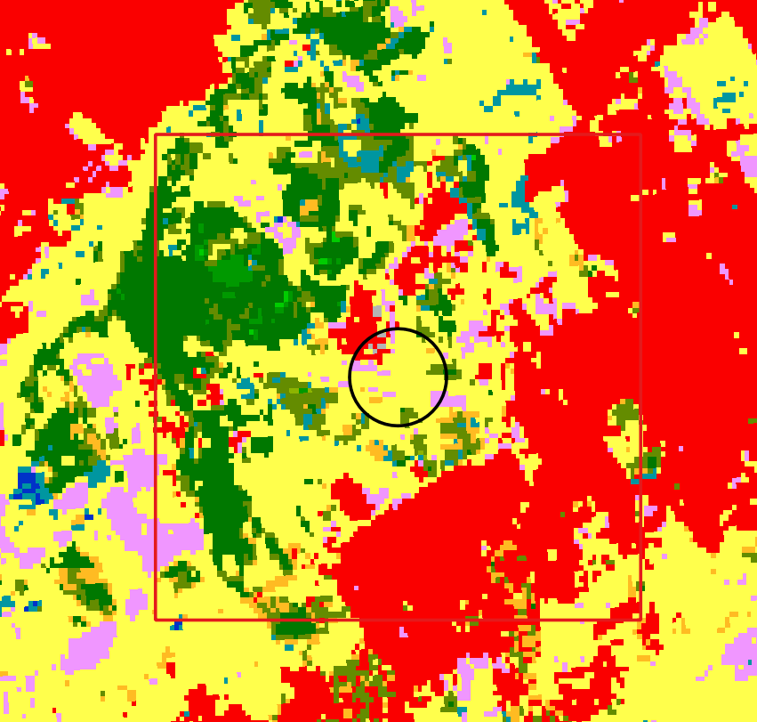

--- 
layout: lecture
title: Aersurface
descripcion: Prerpocesador de superficie.
date: 2024-09-03
clase: 02
ready: true
---

> Tutorial para el preprocesamiento de datos de superficie aermod (**AERSURFACE**)


El **AERSURFACE** es un preprocesador que nos permite estimar parámetros de superficie representativos para las cercanías de la estación meteorológica, usando datos de usos de suelo, canopeo e impermeabilidad del suelo. Es una herramienta "opcional" y no es requisito de EPA su utilización en modelado regulatorio.
Este programa relaciona una clasificación de cobertura del suelo (pastizal, urbano, agua), a una distancia de la estación meteorológica de superficie, para inferir los siguientes parámetros:

1. albedo &alpha;
2. proporción (ratio) de bowen B0
3. longitud de rugosidad de superficie z0 

Este programa necesita datos que requieren un formato de clasificación particular del servicio geológico de estados unidos ([NLCD](https://www.mrlc.gov/)) y que en consecuencia no esta disponible en nuestro país. 

Esta clasificación de cobertura del suelo el USGS define las siguientes clases:


<!-- https://grasswiki.osgeo.org/wiki/File:NLCD_2016_Land_Cover_example.png -->

|Clase|Descripción|
|---|---|
|11|Open Water|
|12|Perennial Snow/Ice|
|21|Developed, Open Space|
|22|Developed, Low Intensity|
|23|Developed, Medium Intensity|
|24|Developed, High Intensity|
|31|Barren Land|
|41|Deciduous Forest|
|42|Evergreen Forest|
|43|Mixed Forest|
|52|Shrub/Scrub|
|71|Herbaceous|
|81|Hay/Pasture|
|82|Cultivated Crops|
|90|Woody Wetlands|
|95|Emergent Herbaceous Wetlands|

Así se visualiza la clasificación de cobertura para un aeropuerto de estados unidos.


Para determinar la clase dominante y sus parámetros asociados se debe analizar la siguiente información.

1. albedo &alpha;:
    - Media *aritmética* de región de 10 km x 10 km centrada en la estación meteorológica. 

2. proporción (ratio) de bowen B0
   - Media *geométrica* de región de 10 km x 10 km centrada en la estación meteorológica.
 
3. longitud de rugosidad de superficie z0
   - En un radio de 1km a la estación meteorológica, se deben analizar 12 direcciones del viento o secciones de 30°. A cada sección se asigna como z0 la media geométrica del valor de rugosidad ponderado de forma inversa a la distancia a la estación. 


Entonces se podrían visualizar a continuación, las dos áreas analizadas.   


Cada sección va a representar una cobertura distinta, con parámetros de albedo, bowen y rugosidad distintas. En el anexo A de la guía de usuario de *AERSURFACE* se listan las tablas completas, a los fines de este tutorial, vamos a extraer y simplificar la información de algunas clases.

|Clase|Descripción|B0 verano|B0 otoño|B0 invierno|B0 primavera|
|-|-|-|-|-|-|
|21 |Low Intensity Residential |0.8 |1| 1 | 0.8|
|22 |High Intensity Residential| 1.5| 1.5 1.5|1.5|
|23|Commercial/Industrial/Transp (Site at Airport)| 1.5 |1.5 |1.5 |1.5|
|85| Urban/Recreational Grasses |0.5 |0.7 |0.7 | 0.3|

|Clase|Descripción|albedo &alpha; verano|albedo &alpha; otoño|albedo &alpha; invierno|albedo &alpha; primavera|
|-|-|-|-|-|-|
|21 |Low Intensity Residential |0.16 |0.16| 0.18 | 0.16|
|22 |High Intensity Residential| 0.18| 0.18| 0.18|0.18|
|23|Commercial/Industrial/Transp (Site at Airport)| 0.18| 0.18| 0.18|0.18|
|85| Urban/Recreational Grasses |0.15 |0.15 |0.18 | 0.15|


|Clase|Descripción|z0 verano|z0 otoño|z0 invierno|z0 primavera|
|-|-|-|-|-|-|
|21 |Low Intensity Residential |0.54 |0.54| 0.5 | 0.52|
|22 |High Intensity Residential| 1| 1| 1|1|
|23|Commercial/Industrial/Transp (Site at Airport)| 0.1 |0.1 |0.1 |0.1|
|85| Urban/Recreational Grasses |0.02 |0.015 |0.01 | 0.015|

Por ejemplo, para el caso de EZEIZA AERO, las áreas a analizar serían las siguientes:


En cuanto a cobertura, la mejor fuente de información disponible hasta el momento es la [clasificación de la agencia espacial europea](https://land.copernicus.eu/global/content/annual-100m-global-land-cover-maps-available) con resolución de 100mx100m y uso de clases de la FAO en vez del servicio geológico de estados unidos.




Ante la falta de capas de cobertura en el formato requerido, debemos
generar esta información a partir del procesamiento realizado por el usuario.

Vamos a crear un archivo de texto llamado ``AERSURFACE.OUT`` y completaremos la siguiente información.

Como las propiedades de superficie pueden cambiar en el tiempo, se debe aclarar la resolución temporal: mensual, estacional ó anualmente.

La palabra clave ``FREQ_SECT`` permite definir como queremos que cambien los parámetros de superficie en el tiempo: (``ANNUAL``, ``SEASONAL`` ó ``MONTHLY``)  y el numero de sectores con superficies distintas alrededor de la estación meteorológica. Para el ejemplo hemos elegido ``SEASONAL`` y escribimos la siguiente primera línea. 

```Text
 FREQ_SECT  SEASONAL  1
```

Con la keyword ``SECTOR`` se define para cada sector cual es el ángulo de inicio y fin que lo define. Siempre considerando que el 0 se encuentra en el norte, y que avanza de forma horaria. Para este ejemplo tomamos todas las direcciones del viento como un solo sector.
```Text
   SECTOR   1  0   360
```

Por último para cada sector y cada estación del año (*season*) hay que definir los valores de albedo, bowen y rugosidad usando la *keyword*: ``SITE_CHAR``.
 Vamos a asumir que todos los parámetros corresponden a la clase *"21 - Low intensity residential"*.
Los parámetros elegidos en este ejemplo se tomaron de las tablas anteriores según las estaciones del año y deben invertirse ya que están definidas para el hemisferio norte.

|Nro estación #| Estación| Meses|
|---|---|---|
|1| Invierno HN| diciembre, enero, febrero|
|2| Primavera HN| marzo, abril, mayo|
|3 |Verano HN| junio, julio, agosto|
|4| Otoño HN| septiembre, octubre, noviembre|

Para esta entrada, vamos a agregar un formato de tabla, con un fin de organizar visualmente la información, ``**`` convierte la línea en un comentario, y por lo tanto no tiene ningún efecto. 
Buscamos para cada "estación" los valores de superficie para la case 21.


|Clase|Descripción|albedo &alpha; verano|albedo &alpha; otoño|albedo &alpha; invierno|albedo &alpha; primavera|
|-|-|-|-|-|-|
|21 |Low Intensity Residential |0.16 |0.16| 0.18 | 0.16|

|Clase|Descripción|B0 verano|B0 otoño|B0 invierno|B0 primavera|
|-|-|-|-|-|-|
|21 |Low Intensity Residential |0.8 |1| 1 | 0.8|

|Clase|Descripción|z0 verano|z0 otoño|z0 invierno|z0 primavera|
|-|-|-|-|-|-|
|21 |Low Intensity Residential |0.54 |0.54| 0.5 | 0.52|

```Text
**------------------------------------------------|
**          | season | section | a0  | b0  | z0   |
**----------|--------|---------|-----|-----|------|
   SITE_CHAR    1        1      0.16  0.80  0.54
   SITE_CHAR    2        1      0.16  1.00  0.54
   SITE_CHAR    3        1      0.18  1.00  0.50
   SITE_CHAR    4        1      0.16  0.80  0.52
**----------|--------|---------|-----|-----|------|
```


El contenido final de  ``AERSURFACE.OUT`` debería ser el siguiente:

```Text
 FREQ_SECT  SEASONAL  1
   SECTOR   1  0   360
**------------------------------------------------|
**          | season | section | a0  | b0  | z0   |
**----------|--------|---------|-----|-----|------|
   SITE_CHAR    1        1      0.16  0.80  0.54
   SITE_CHAR    2        1      0.16  1.00  0.54
   SITE_CHAR    3        1      0.18  1.00  0.50
   SITE_CHAR    4        1      0.16  0.80  0.52
**----------|--------|---------|-----|-----|------|
```

Podría darse un caso donde existan diferencias en las propiedades de superficie del radio de 1km a la fuente de información de velocidad del viento. 


En ese caso agregamos la definición del nuevo sector y agregamos las líneas para cada estación en la sección "2", vamos a asumir que la clase correspondiente es "85 - Urban/Recreational Grasses" y tendrá valores distintos en z0 ya que se calculan para cada sección, sin embargo comparte los valores de b0 y a0 con el sector 1 porque estos son calculados para la región de 10km x 10km. 

```Text
 FREQ_SECT  SEASONAL  2
   SECTOR   1  0   330
   SECTOR   2  330   360
**------------------------------------------------|
**          | season | section | a0  | b0  | z0   |
**----------|--------|---------|-----|-----|------|
   SITE_CHAR    1        1      0.16  0.80  0.54
   SITE_CHAR    2        1      0.16  1.00  0.54
   SITE_CHAR    3        1      0.18  1.00  0.50
   SITE_CHAR    4        1      0.16  0.80  0.52
   SITE_CHAR    1        2      0.16  0.80  0.02
   SITE_CHAR    2        2      0.16  1.00  0.015
   SITE_CHAR    3        2      0.18  1.00  0.01
   SITE_CHAR    4        2      0.16  0.80  0.015
**----------|--------|---------|-----|-----|------|
```
