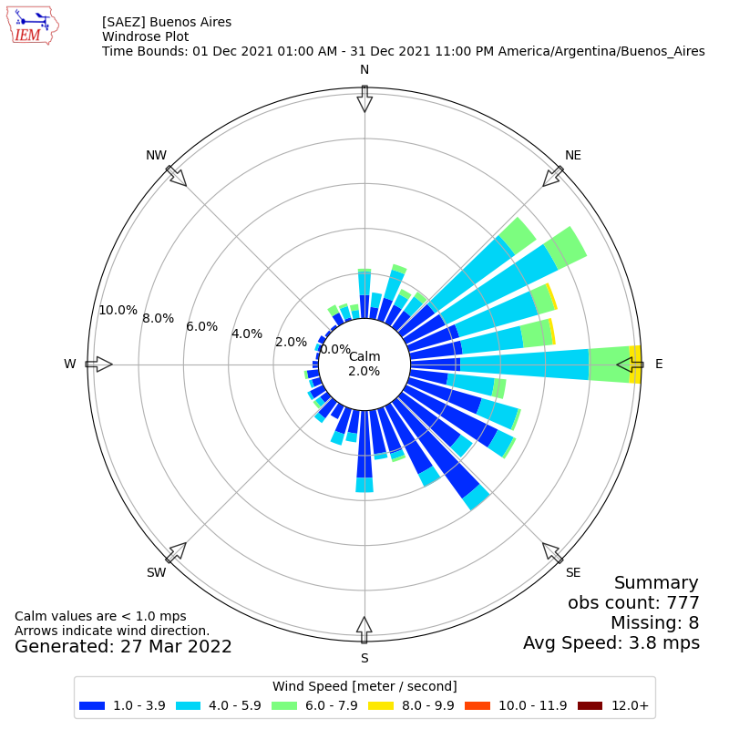

--- 
layout: lecture
title: Aerpost
descripcion: Post-procesador de aermod.
date: 2024-09-05
ready: true
---

# Postprocesamiento

Herramientas para el postprocesamiento e interpretación de los datos de salida de modelos.
{: .fs-6 .fw-300 }

## Tablas de datos desde AERMOD y AERMET:
Tanto AERMOD como AERMET no generan salidas gráficas por lo que se deben usar otros programas para este fin, sin embargo los reportes y salidas que generan los modelos suelen presentarse en formato de tablas fáciles de interpretar en programas de hoja de cálculo. Aermod genera reportes y controles de calidad donde se puede analizar y validar la mayoría de la información, sin embargo es conveniente extraer los resultados a otros medios para poder visualizar, reportar y analizar la información.
El archivo de salida generado en la opción ``PLOTFILE``, que en el caso del tutorial denominamos: "AERPLOT_PRUEBA_NOX_MONTH.OUT", tiene los resultados de concentraciones máximas de cada receptor en un formato de tabla que será fácil de exportar. Otra alternativa para procesar como tabla podría ser la salida de aermet ``.SFC``.


```
* AERMOD (21112 ):  PRUEBA                                                                  03/13/22
* AERMET ( 21112):                                                                          16:00:50
* MODELING OPTIONS USED:   NonDFAULT  CONC  FLAT  FLGPOL  RURAL
*         PLOT FILE OF  HIGH   1ST HIGH MONTH VALUES FOR SOURCE GROUP: ALL     
*         FOR A TOTAL OF 10000 RECEPTORS.
*         FORMAT: (3(1X,F13.5),3(1X,F8.2),3X,A5,2X,A8,2X,A5,5X,A8,2X,I8)                                                                                                                                                  
*        X             Y      AVERAGE CONC    ZELEV    ZHILL    ZFLAG    AVE     GRP       RANK     NET ID   DATE(CONC)
* ____________  ____________  ____________   ______   ______   ______  ______  ________  ________  ________  ________
  359333.28100 6137044.02000       0.05279     0.00     0.00     1.50   MONTH  ALL         1ST     CAR1      21123124
  359383.28100 6137044.02000       0.05247     0.00     0.00     1.50   MONTH  ALL         1ST     CAR1      21123124
  359433.28100 6137044.02000       0.05216     0.00     0.00     1.50   MONTH  ALL         1ST     CAR1      21123124
  359483.28100 6137044.02000       0.05185     0.00     0.00     1.50   MONTH  ALL         1ST     CAR1      21123124

```
En esta tabla, las primeras 8 filas corresponden al contexto de la tabla y sus encabezados. Vamos a seleccionar todas las filas desde la 9, nos paramos con el cursor en la primera columna de la fila 9 y presionamos <kbd>Ctrl</kbd>+<kbd>shift</kbd>+<kbd>Fin</kbd>. Copiamos el contenido y abrimos una aplicación de hoja de cálculos como Excel.
En una hoja nueva, pegamos el contenido en la celda **A1**.


Vemos que se generan líneas de texto que necesitamos se parar en campos.
Dependiendo de la configuración regional la coma o el punto pueden ser separadores de miles o decimales, si el separador de decimales es la coma, debemos reemplazar los puntos por coma. Abrimos el menú de buscar y reemplazar con <kbd>Ctrl</kbd>+<kbd>b</kbd>, vamos a buscar el caracter ".", reemplazarlo por "," y <kbd>Reemplazar todos</kbd>.


Seleccionamos toda la columna **A** clickeando sobre ella y vamos a la pestaña de **Datos** y buscamos la herramienta texto en columnas. 


Aseguramos que este seleccionada la opción "ancho fijo" y clickeamos <kbd>Finalizar</kbd>.


Ya tenemos la información en tabla para ser procesada, pero es conveniente contar con una fila adicional de encabezado. Vamos a insertar una fila en "1", clickeando con el botón derecho y seleccionando "Insertar".
A esta nueva fila 1 le colocaremos los encabezados del plotfile que tiene la fila 7. En esta instancia ya tenemos lista la tabla de resultados para procesar.

Salida de **AERMOD**:


Salida de **AERMET**:


La principal utilidad de la tabla en **AERMOD** sería permitir:
 
 - Graficar ubicación de concentraciones máximas.
 - Encontrar máximos, sumar la concentración de fondo, compararlos con estándares y reportar ubicación y fecha de ocurrencia.
-  Analizar frecuencia y distribución de concentraciones máximas.

La principal utilidad de la tabla en **AERMET** sería permitir:

- Aplicar fórmulas para auditar los datos obtenidos.
- Graficar evolución de parámetros y auditar continuidad.

[Ejemplo de planilla de procesamiento del archivo SFC.](./archivos/post/sfc_procesamiento.xlsx)


## Rosa de vientos:

Considerando que la dirección y la velocidad del viento son factores determinantes en la dispersión del contaminante, es conveniente analizar la información mediante una visualización de rosa de vientos para el período modelado.
Vamos a usar una herramienta [web](https://mesonet.agron.iastate.edu/sites/locate.php), pero existen varias alternativas ( [WRPLOTview-lakes](https://www.weblakes.com/software/freeware/wrplot-view/), [Openair-R](https://www.rdocumentation.org/packages/openair/versions/2.8-6/topics/windRose), [-Python](https://github.com/python-windrose/windrose)).

Vamos a entrar al sitio de la universidad de Iowa siguiendo el link: [https://mesonet.agron.iastate.edu/sites/locate.php](https://mesonet.agron.iastate.edu/sites/locate.php)

Por defecto,  se encuentra seleccionada la red de estaciones de Iowa, vamos a desplegar de **Select By Network** el menú, buscar "Argentina", luego pulsamos el botón <kbd>Switch Netork</kbd>.


Al cargarse la red de "Argentina", se visualizan todas las estaciones del SMN. Buscamos en **Select by Station:** la fuente de información de superficie, que en este caso es "EZEIZA AERO" cuyo ID es "SAEZ" y tocamos <kbd>Select Station</kbd>.  


En esta página se muestra información histórica de la estación y hasta se permite bajar datos en series de tiempo limitadas. Para crear la rosa de vientos vamos a la pestaña <kbd>Custom Wind Roses</kbd>.


Vamos a elegir el mismo rango temporal que en el modelado (12/2021) y cambiamos las unidades a *"Meters per second (MPS)"* luego generamos la imagen tocando el botón <kbd>Enviar</kbd>.


Al esperar unos segundos, la página genera la rosa de vientos solicitada. Esta visualización representa la dirección de origen y frecuencia de velocidades del viento.   



## AERPLOT

Para facilitar la visualización de los resultados y evaluar la dimensión espacial de la dispersión de contaminantes, se debe representar en mapas el resultado del modelado.
La herramienta AERPLOT de EPA permite visualizar los resultados del aermod en un entorno espacializado. Vamos a utilizar la herramienta de google earth. A una baja densidad de receptores, la visualización puede realizarse desde la [aplicación web de google earth](https://earth.google.com/web/@-34.87672737,-58.5116322,25.13054835a,2580.54459079d,35y,57.93916891h,13.67659437t,360r), como se realizarán varias visualizaciones debemos [bajar e instalar](https://www.google.com/intl/es-419/earth/versions/) el programa de escritorio.

Vamos a descargar el programa AERPLOT del [repositorio de epa](https://gaftp.epa.gov/Air/aqmg/SCRAM/models/related/aerplot/aerplot_16216.zip) y descomprimimos el contenido de la carpeta en el mismo directorio de trabajo de aermet y aermod.
Vemos que los nuevos archivos en la carpeta son:
```
aerplot.exe
aerplot.inp
aerplot_readme.txt
```
De forma similar a aermet y aermod, hay un ejecutable (``aerplot.exe``) y un archivo de control (``aerplot.inp``) donde especificaremos la información de entrada.
Vamos a abrir ``aerplot.inp`` con block de notas. Vemos que es un archivo extenso de 319 líneas, donde la mayoría están comentadas con el caracter ";" y solo pocas líneas requieren una entrada del usuario.  
El archivo esta separado en 13 secciones, pero nos enfocaremos en las principales.

En la línea 10 (el número de línea se muestra en el cuadro del marco inferior, donde en esta imagen dice "Ln 10") encontramos la sección ``;- input parameters ``:


Vamos a dejar en la línea 32 como `` origin=UTM `` ya que viene por defecto pero debemos editar las líneas 55 a 57 para especificar zona UTM del hemisferio sur:
```
easting=0
northing=0
utmZone=21
inNorthernHemisphere=false
```
En la siguiente sección, línea 96, vamos a especificar el nombre del archivo "PLOTFILE" que muestra la tabla de resultados y el archivo de entrada a aermod de donde el programa tomará las ubicaciones de las fuentes.

```

;;;;;;;;;;;;;;;;;;;;;;;;;;;;;;;;;;;;;;;;;;;;;;;;;;;;;;;;;;;;;;;;;;;;;;;;;;;;;
;
;- the source data file
;  ====================
;  (output from aermod, presumably)
;
; The input file name, that is, the plotfile.
PlotFileName              =AERPLOT_PRUEBA_NOX_MONTH.OUT

; If one wishes to plot the sources as well, set this to the aermod.inp file.
; If not, leave it empty.
SourceDisplayInputFileName=aermod.inp

;

```
En la siguiente sección, línea 108, vamos a cambiar el nombre del archivo de salida:

```
;;;;;;;;;;;;;;;;;;;;;;;;;;;;;;;;;;;;;;;;;;;;;;;;;;;;;;;;;;;;;;;;;;;;;;;;;;;;;
;
;- output parameters
;  =================
;
; The output file names.
;
; Pick a name for this run, and it will be applied to a number of files,
; plus the objects that may be manipulated within Google Earth.
;
OutputFileNameBase        =PRUEBA_NOX_MONTH_AERPLOT_Run
;
; The name that will be displayed in Google Earth for the dataset.
NameDisplayedInGoogleEarth=NOX_Mensual_Aerplot
;
;

```

La siguiente sección (`` ;- concentration binning``) en la línea 165, es la mas probable de ser modificada a medida que se hacen visualizaciones. En esta se definen las "clases" de concentración en las que se van a agrupar los resultados, en distintos tonos de color, con máximo de 11.
Vamos a editar la línea 175 para que diga:

```
binningChoice = custom
```
De esta forma nos permite definir las clases. Como sabemos viendo los resultados que el máximo de la corrida fue "1.8" esta va a ser la máxima clase, las siguientes restantes las haremos en decrecimiento gradual. La línea 181 va a quedar comentada, agregando un ";" al inicio y se descomentará la línea 182, borrando el ";".
Esta podría ser una posible definición de clases:

```
customBinningElevenLevels=.0007,.001, .004,.008,.01,.02,.03,.05,1,1.5,1.7
```
Entonces la sección completa queda así:

```

;;;;;;;;;;;;;;;;;;;;;;;;;;;;;;;;;;;;;;;;;;;;;;;;;;;;;;;;;;;;;;;;;;;;;;;;;;;;;
;
;- concentration binning  (for receptors and contours)
;  =====================
;
; The user has the choice between a "Linear" or "Log" color scale. The user
; also can provide one of their own.
;
; There must, however, be eleven "levels" or thresholds that will
; define the ranges for the twelve bins.
minbin=0.2e-7
maxbin=data
binningChoice = custom
; or binningChoice = Linear
; or binningChoice = custom
; binningChoice = Log
;
; These examples could be realistic binning schemes.
;customBinningElevenLevels=1,2,3,4,5,6,7,8,9,10,11
customBinningElevenLevels=.0007,.001, .004,.008,.01,.02,.03,.05,1,1.5,1.7
;
; If custom binning is not used, one may prefer to supply this value, "na",
; to help indicate that custom binning is not used.
;customBinningElevenLevels=na
;
;

```

Hasta el momento, la representación de los resultados se visualizará como puntos, para agregar líneas de igual concentración o "isopletas", vamos a editar la línea 238 de la siguiente manera:

```
makeContours                        = true
```
Con estas ediciones finalizadas vamos a guardar este archivo de texto y ejecutar en el directorio de trabajo el programa ``aerplot.exe``.
Durante la ejecución, vemos la ventana de la consola mostrando el progreso de las tareas. Al finalizar, se debió crear el archivo ``PRUEBA_NOX_MONTH_AERPLOT_Run.kmz`` y si ya tenían instalado google earth, por defecto lo abre mostrando el resultado.


Podemos ver las clases de concentración donde cada punto es un receptor e isopletas, con una cruz se muestran las fuentes del modelo.


 
 Con esta visualización se pueden analizar numerosos aspectos del resultado:
 
 + Verificar la geometría y distribución de la grilla de receptores.

 + Medir distancias a la máxima concentración, desde el límite del predio o las fuentes

+ Concluir si la densidad y extensión de la grilla de receptores es adecuada.

+ Conocer el contexto de la ubicación de máximos.
  
+ Evaluar concentraciones en sitios de interés o receptores críticos (establecimientos de salud o primera infancia).

+ Encontrar la mejor definición de clases que maximice la resolución cerca del máximo.

